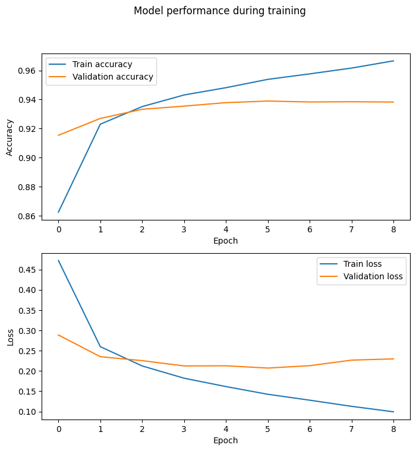

# **PBL4 - Healthy Heart**

## **Team members**

- Từ Đức Mạnh
- Trần Quang Thắng
- Bùi Quốc Khánh
- Lê Duy Phương Hà

## ** Repo have a model Train** 

## **Thông tin dữ liệu**

- Data được lấy từ MIT-BIH Arrhythmia Database, kết quả đo từ 45 bệnh nhân, bao gồm 19 nữ (23 - 89 tuổi) và 26 nam (32 - 89 tuổi) ở tần số 360Hz.
- Liên kết đến bộ dữ liệu: [link](https://www.physionet.org/content/mitdb/1.0.0/)
- Dataset có nhiều phân lớp. Nhưng nhóm chỉ lấy ra 6 lớp để đo, cụ thể:
  - NOR: Normal - Nhịp xoang bình thường
  - PVC: Premature Ventricular Contraction - Nhịp tâm thất bất thường xuất phát từ tâm thất.
  - APB: Atrial Premature Beat - Nhịp xoang bất thường xuất phát từ tâm nhĩ.
  - LBB: Left Bundle Branch Block - Rối loạn dẫn truyền do khối nhánh trái bị ngăn cản.
  - RBB: Right Bundle Branch Block - Rối loạn dẫn truyền do khối nhánh phải bị ngăn cản.
  - PAB: Paced Beat - Nhịp tim được tạo bởi máy phát nhịp điện cắm trong cơ thể.

## **Thông tin về model**

- Nhóm tiến hành xây dựng model với thông tin cụ thể như sau:
  => Xây dựng dựa trên cấu trúc CNN tham khảo từ bài báo “ECG arrhythmia classification using a 2-D convolutional neural network”  ([link](https://www.researchgate.net/publication/317578658_ECG_arrhythmia_classification_using_a_2-D_convolutional_neural_network_Submitted)). Mô hình được huấn luyện trên bộ dữ liệu Dataset Train.

## **Kết quả đạt được của model**

